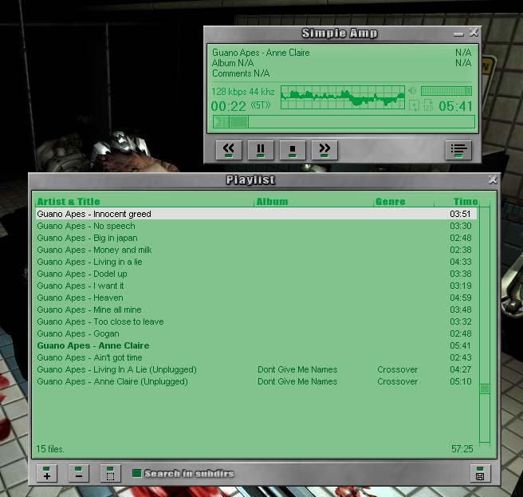



## Simple Amp 1\.2

### Description

Simple Amp is an simple MP3 player with lot's of great features:

* Supports MP1, MP2 & MP3

* FULLY skinnable program, you can even change size and move

controls to new locations.

* 3 Skins included.

* Supports editing of ID3v1 & ID3v2 tags, even of multiple

files at the same time.

* Playlist with lots of features. Save/Load Playlist, add dir,

sorting, and much more.

* 5 different scopes that let you SEE the music.

* Hotkeys. Lets you control the program from the keyboard

whenever you want (you don't have to have the program in

focus). Read readme.txt for more info.

* Pitch Control. You can change the pitch of the music, realtime!

* Advanced soundcard controls. Select mixing quality (Hz, 8/16 bits

Stereo/Mono), select music buffer size & pan the sound.

* You can minimize the program to the Systray.

* The program can be always ontop.

* The windows snaps to screen edges.

And lots of more minor features that you can find for yourself. Please vote!
 
### More Info
 

             |
---                |---
**Submitted On**   |2002-06-07 09:12:40
**By**             |[Paul Berlin](https://github.com/Planet-Source-Code/PSCIndex/blob/master/ByAuthor/paul-berlin.md)
**Level**          |Advanced
**User Rating**    |4.8 (105 globes from 22 users)
**Compatibility**  |VB 6\.0
**Category**       |[Sound/MP3](https://github.com/Planet-Source-Code/PSCIndex/blob/master/ByCategory/sound-mp3__1-45.md)
**World**          |[Visual Basic](https://github.com/Planet-Source-Code/PSCIndex/blob/master/ByWorld/visual-basic.md)
**Archive File**   |[Simple\_Amp91309672002\.zip](https://github.com/Planet-Source-Code/paul-berlin-simple-amp-1-2__1-35571/archive/master.zip)

